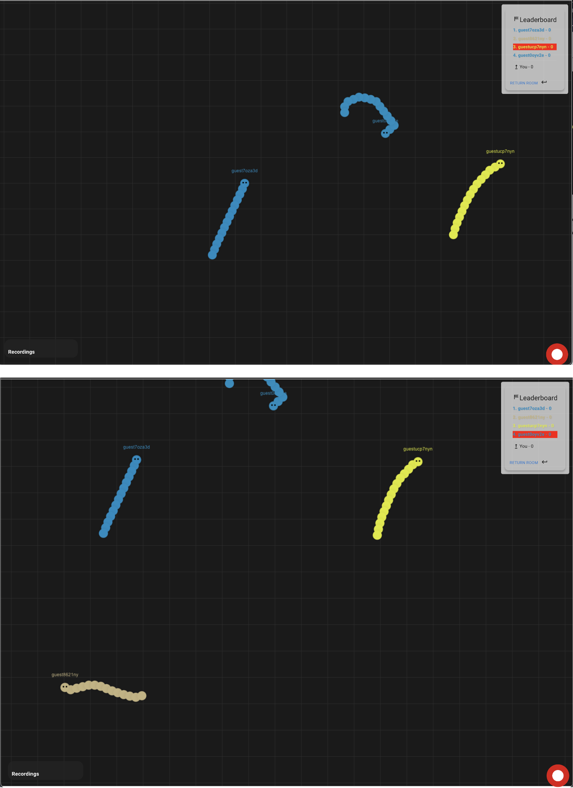

<h1 align="center">Multiplayer snake game</h1>


#### This is a snake online game for multiple players 
#### keep improving the engine performance

## :sparkles: Skills
- `Springboot`
- `Mongodb`
- `Rabbitmq`
- `Redis`
- `React`


## :book: How to use
To clone and run this application
```
# Clone this repository
$ git clone https://git.cs.bham.ac.uk/projects-2023-24/lxc645.git
 
# Go into the each backend modules and combine the commands as third point.
$ cd RunningService
$ cd RecordingService

#Each backend modules run commands as follows:
# Install dependencies
$ mvn clean package

# Run the app
$ java -jar target/RunningService-1.jar
$ java -jar target/RecordingService-1.jar

# Go into the repository
$ cd frontend_web

# Run the app
$ npm start

# if the `npm start` doesn't work then:
$ ./setup_run_frontend.sh

```
## :wrench: Functions
-  Process:
1. [x] Pk
2. [x] LeaderBoard
3. [x] Recording function
4. [x] PlaybackPage function


