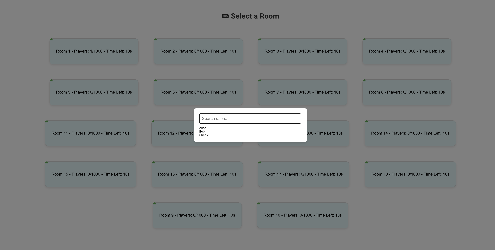

<h1 align="center">Multiplayer snake game - v2.0.0-exp </h1>

## :wrench: Tasks
- Scalability - Kubernetes auto Scaling - HPA
    
## :sparkles: Skills
- `Kubernetes`
- `Docker`
- `HPA`


## :wrench: the command
go to the root directory

to build the docker image
`docker build -t reene44444/runningservice:latest_exp_sca .`

to push the image to the dockerhub
`docker push reene44444/runningservice:latest_exp_sca`

apply the kubectl resource(including the services and deployment)
`kubectl apply -f kubernetes-resources.yaml`

delete the kubectl resource(including the services and deployment) and re-apply the yaml source , the source will be reconfigured
`kubectl delete -f kubernetes-resources.yaml`

## :wrench: process



<!-- # Kubernetes directory structure

```plaintext
kubernetes/
├── base/
│   ├── backend-deployment.yaml
│   ├── backend-service.yaml
│   ├── nginx-deployment.yaml
│   ├── nginx-service.yaml
│   ├── redis-deployment.yaml
│   ├── redis-service.yaml
│   ├── mongodb-deployment.yaml
│   ├── mongodb-service.yaml
│   └── kafka-deployment.yaml
│       └── kafka-service.yaml
├── overlays/
│   ├── dev/
│   │   ├── kustomization.yaml
│   │   ├── backend-deployment.yaml
│   │   ├── nginx-deployment.yaml
│   │   ├── redis-deployment.yaml
│   │   ├── mongodb-deployment.yaml
│   │   └── kafka-deployment.yaml
│   ├── prod/
│   │   ├── kustomization.yaml
│   │   ├── backend-deployment.yaml
│   │   ├── nginx-deployment.yaml
│   │   ├── redis-deployment.yaml
│   │   ├── mongodb-deployment.yaml
│   │   └── kafka-deployment.yaml
│   └── staging/
│       ├── kustomization.yaml
│       ├── backend-deployment.yaml
│       ├── nginx-deployment.yaml
│       ├── redis-deployment.yaml
│       ├── mongodb-deployment.yaml
│       └── kafka-deployment.yaml
└── kustomization.yaml -->


