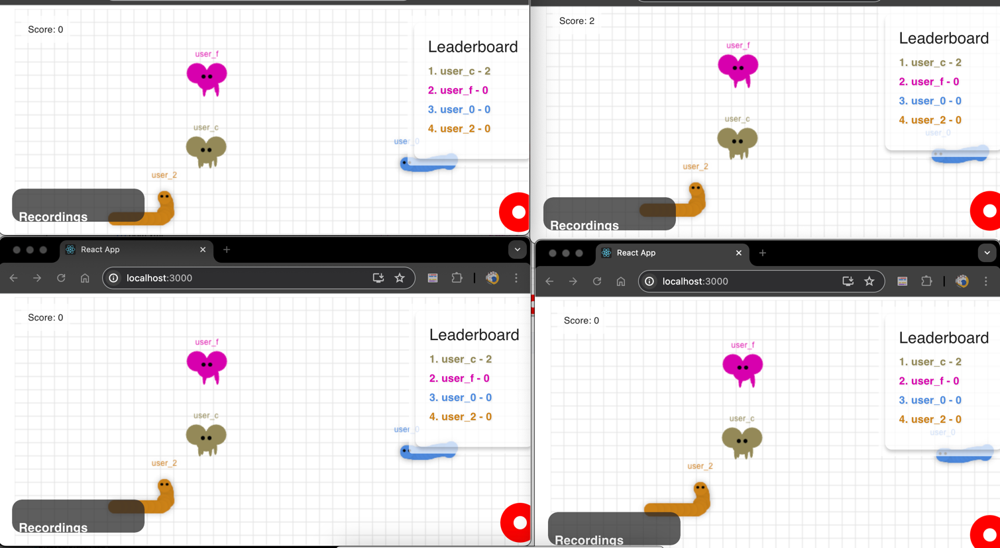

<h1 align="center">King of Bots</h1>


#### this is a small snake online game

## :sparkles: Skills
- `Springboot`
- `Mongodb`
- `React`

## :book: How to use
To clone and run this application
```
# Clone this repository
$ git clone https://github.com/Reene444/King_of_bots
 
# Go into the each backend modules and combine the commands as third point.
$ cd DiscoveryServer
$ cd ApiGateway
$ cd RunningService
$ 

#Each backend modules run commands as follows:
# Install dependencies
$ mvn clean package

# Run the app
$ java -jar target/Discovery-0.0.1-SNAPSHOT.jar
$ java -jar target/ApiGateway-0.0.1-SNAPSHOT.jar
$ java -jar target/RunningService-0.0.1-SNAPSHOT.jar


# Go into the repository
$ cd frontend

# Run the app
$ npm start

```
## :wrench: Functionsf
-  Process:
1. [x] Pk
2. [x] LeaderBoard
3. [ ] Recording function
4. [ ] PlaybackPage function

## Blogs for implementing
[Blogs for implementing](https://www.blogger.com/blog/posts/3583988235096926786)

## Page Link

[//]: # (![img_1.png]&#40;img_1.png&#41;)



